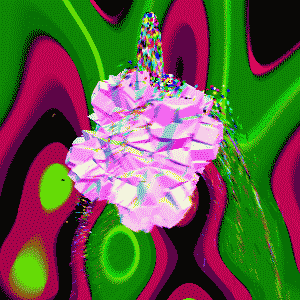

# Everyday One Motion - 20160407  

"IFS vs. Particle"  

  

JavaScript, WebGL, Raymarching, GPGPU Particle  

[Everyday One Motion](http://motions.work/motion/181)  
[Demo Page](http://fms-cat-eom.github.io/20160407/dist)  

## 今月のテーマ

今月は、ノーテーマでやろうと考えていたのですが、あえて言えば「Weird」をテーマとしてもよい気がしてきました。  

## Depth Test

Raymarcherを描画する際に、色とは別にDepthをレンダリングしておき、パーティクルを描画するときにDepth Testに掛ける、という技を用いています。  
これにより、全く別のレンダリング手法で描画されるレイマーチングIFSとパーティクルをおなじシーン内に共存させることが可能となりました。  
ちなみに、OpenGLのDepth Testを使ったわけではなく、オレオレDepth Testです。  

## Plasma

背景にはプラズマエフェクトを採用しました。  
プラズマエフェクトとは、二次元平面上で様々なサイン波を複数足し合わせることにより生み出される、複雑な模様です。  
以下のドキュメントを参考にさせていただきました。  
http://www.bidouille.org/prog/plasma
